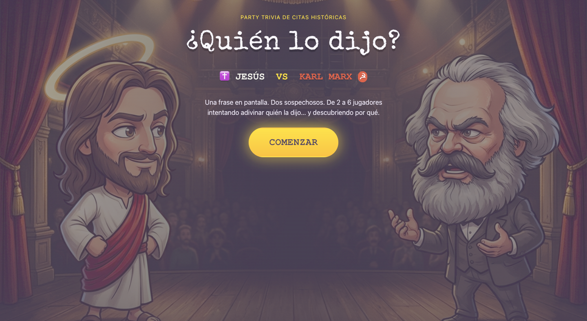
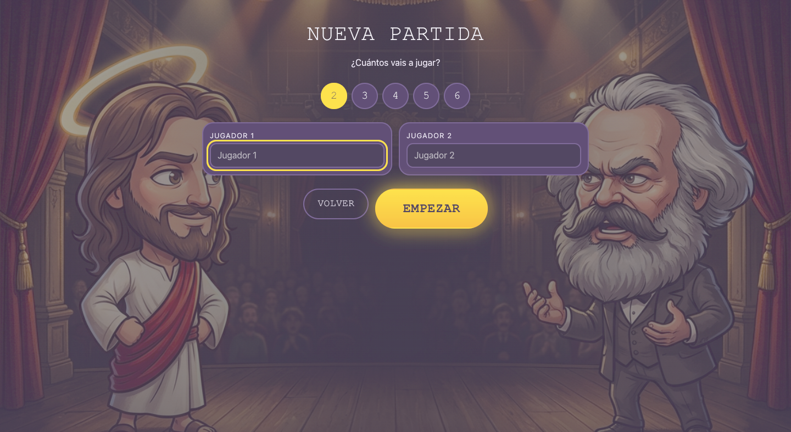
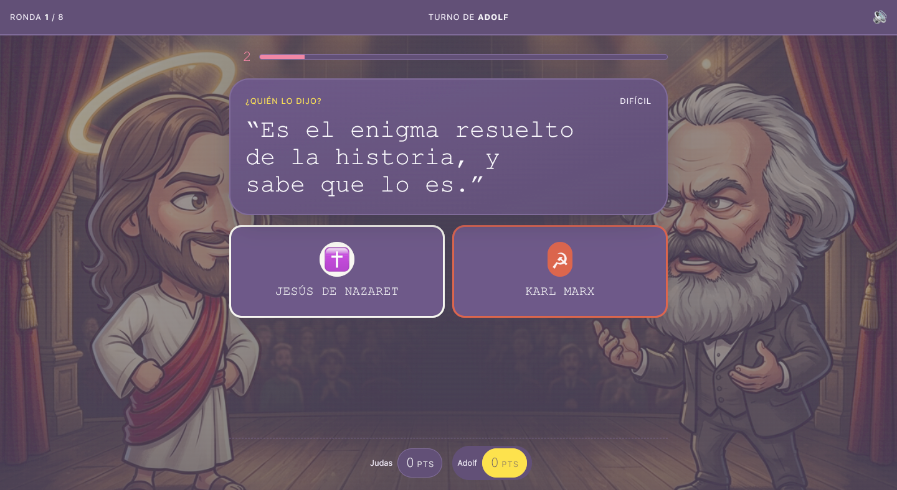
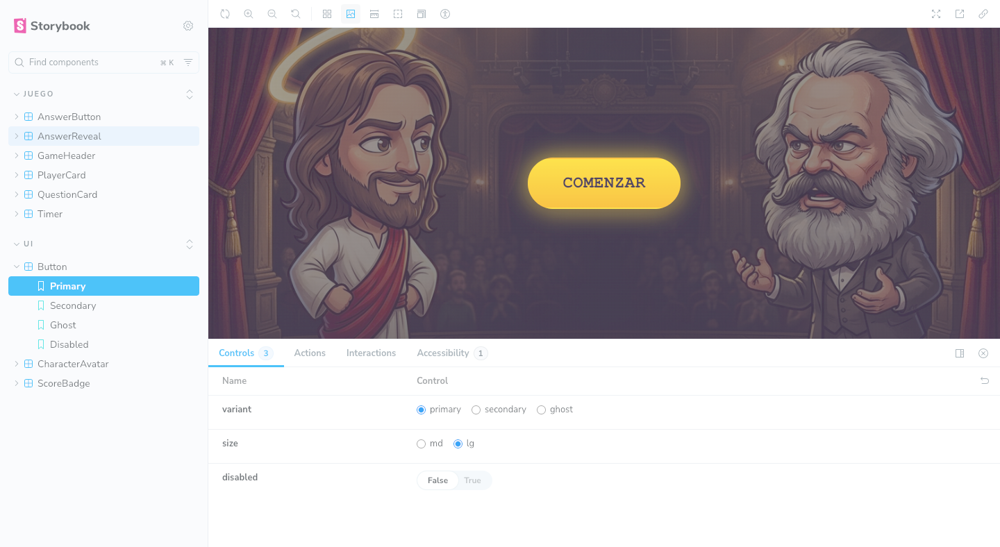

# 🎭 ¿Quién Lo Dijo?

> Party trivia de citas históricas. Una frase en pantalla, dos sospechosos y de 2 a 6 jugadores
> intentando adivinar quién la dijo… y descubriendo por qué.

**Jesús ✝️ VS Karl Marx ☭**

La primera versión enfrenta únicamente a Jesús de Nazaret y Karl Marx, pero el motor del juego es
agnóstico a los personajes: añadir nuevos duelos consiste en ampliar los datos, no en reescribir la
lógica.

---

## Estado del proyecto

🚧 **Fase 2 — Partida jugable.** Se puede crear una partida de 2 a 6 jugadores, responder frases con
cuenta atrás y ver el marcador final. Faltan las ilustraciones, la música definitiva y el modo
online.

| Área                           | Estado              |
| ------------------------------ | ------------------- |
| Arquitectura y motor de juego  | ✅ Listo y testeado |
| Design system y tokens         | ✅ Base definida    |
| Pantalla de bienvenida         | ✅ Funcional        |
| Creación de partida y tablero  | ✅ Funcional        |
| Marcador y pantalla final      | ✅ Funcional        |
| Narración de las frases        | ✅ Funcional        |
| Ilustraciones, música y SFX    | ⏳ Provisionales    |
| Multijugador online (Supabase) | 🗓️ Planificado      |

---

## Capturas

<p align="center">
  
  
  
  
</p>

---

## Concepto del juego

1. Pantalla de bienvenida.
2. Crear partida y elegir número de jugadores (2–6).
3. Cada jugador elige avatar.
4. Se muestra una frase con 15 segundos para responder.
5. ¿Jesús ✝️ o Karl Marx ☭?
6. Se revela la respuesta con una animación y su contexto histórico.
7. Se asignan puntos (con bonus por rapidez) y pasa el turno.
8. Marcador final y ganador.

Las frases incluyen **fuente verificable** (versículo u obra). No se inventan citas.

---

## Stack tecnológico

| Capa                | Tecnología                                     |
| ------------------- | ---------------------------------------------- |
| Framework           | Angular 20 (standalone + Signals)              |
| Lenguaje            | TypeScript 5.9 en modo estricto                |
| Estilos             | Tailwind CSS 4 + CSS Variables (design tokens) |
| Componentes         | Componentes propios + Angular CDK              |
| Animación           | GSAP (interfaz) + lottie-web (ilustración)     |
| Audio               | Howler.js + Web Speech API                     |
| Documentación de UI | Storybook 9                                    |
| Tests unitarios     | Vitest                                         |
| Tests E2E           | Playwright                                     |
| Calidad             | ESLint (angular-eslint) + Prettier             |

> El estado se gestiona exclusivamente con **Angular Signals**. NgRx queda descartado en esta fase.

---

## Requisitos

- Node.js `^20.19.0 || ^22.12.0 || >=24` (probado con **Node 20.20.2**)
- npm 10+

---

## Instalación

```bash
git clone https://github.com/felipemvrin/quienlodijo-game.git
cd quienlodijo-game
npm install
```

## Ejecución local

```bash
npm start           # http://localhost:4200
```

## Comandos disponibles

```bash
npm start             # servidor de desarrollo
npm run build         # build de producción
npm test              # tests unitarios (Vitest)
npm run test:watch    # tests en modo watch
npm run test:e2e      # tests end to end (Playwright)
npm run lint          # ESLint
npm run format        # Prettier
npm run storybook     # Storybook en http://localhost:6006
```

### Nota sobre Playwright en macOS 12

Los navegadores que descarga Playwright requieren macOS 13 o superior. La configuración usa el canal
`chrome` (Google Chrome del sistema), por lo que **no hace falta `npx playwright install`** en
macOS 12. En CI (Linux) puede cambiarse a Chromium sin más ajustes.

---

## Estructura del proyecto

```
src/
├── app/
│   ├── core/
│   │   └── repositories/      # Contratos + implementación local (futuro: Supabase)
│   ├── shared/
│   │   └── ui/                # Design system: Button, AnswerButton, PlayerCard, …
│   ├── game/
│   │   ├── engine/            # Lógica pura del juego (sin Angular)
│   │   ├── models/            # Tipos e interfaces del dominio
│   │   └── services/          # Puente con Angular: estado, audio, animación
│   └── features/
│       ├── welcome/           # bienvenida
│       ├── setup/             # creación de partida
│       ├── board/             # tablero de juego
│       └── results/           # marcador final
│
├── assets/
│   ├── audio/                 # narraciones, música y efectos
│   ├── animations/            # Lottie
│   ├── characters/            # retratos
│   └── data/                  # characters.json, questions.json, avatars.json
│
└── styles/
    ├── tokens.css             # design tokens
    └── global.css             # estilos globales + mapeo a Tailwind
```

### Principios de arquitectura

- **El motor no sabe que existe Angular.** `GameEngine`, `TurnManager`, `ScoreManager` y
  `QuestionEngine` son TypeScript puro: triviales de testear y reutilizables en un futuro modo
  online.
- **UI State y Game State separados.** `GameStateService` expone el estado del motor como signals y
  mantiene aparte el estado puramente visual (cargas, catálogo).
- **Los datos entran por repositorios.** `QuestionRepository`, `PlayerRepository` y `GameRepository`
  son interfaces; hoy se resuelven con implementaciones locales y mañana con Supabase, sin tocar el
  motor.
- **Sin colores hardcodeados.** Todo pasa por los design tokens de `src/styles/tokens.css`.

### Sobre el audio

Cada una de las 16 frases tiene una narración MP3 en `src/assets/audio/quotes/`. `SpeechService` las
reproduce con Howler.js y utiliza Web Speech API como respaldo si un archivo no está disponible o
el navegador no puede reproducirlo. El control de silencio detiene tanto la narración como los
efectos y la música.

La música y los efectos siguen siendo provisionales. Cuando falta uno de esos archivos,
`AudioService` genera un efecto sintético con Web Audio o continúa sin interrumpir la partida. La
procedencia, el formato y las instrucciones de regeneración están documentados en
`src/assets/audio/README.md`.

---

## Testing

```bash
npm test
npm run test:e2e
```

Los tests unitarios cubren el motor y los servicios de narración: puntuación, rotación de turnos,
límites de jugadores, reproducción de MP3 y respaldo mediante Web Speech API.

---

## Roadmap

- [x] Base técnica: Angular, Tailwind, GSAP, Howler, Storybook, testing
- [x] Motor de juego con tests
- [x] Design system y pantalla de bienvenida
- [x] Creación de partida y selección de avatares
- [x] Tablero de juego con countdown y reveal animado
- [x] Marcador y pantalla de victoria
- [ ] Ilustraciones, música y animaciones Lottie definitivas
- [ ] Persistencia con Supabase (PostgreSQL)
- [ ] Modo TV: pantalla principal + móviles como mandos (Supabase Realtime)
- [ ] Nuevos personajes más allá de Jesús y Marx

---

## Licencia

MIT.

Las citas incluidas se acompañan de su fuente. La licencia MIT del código no sustituye las
condiciones aplicables a servicios o recursos de terceros; consulta la documentación de cada tipo
de asset antes de redistribuirlo o utilizarlo comercialmente.
